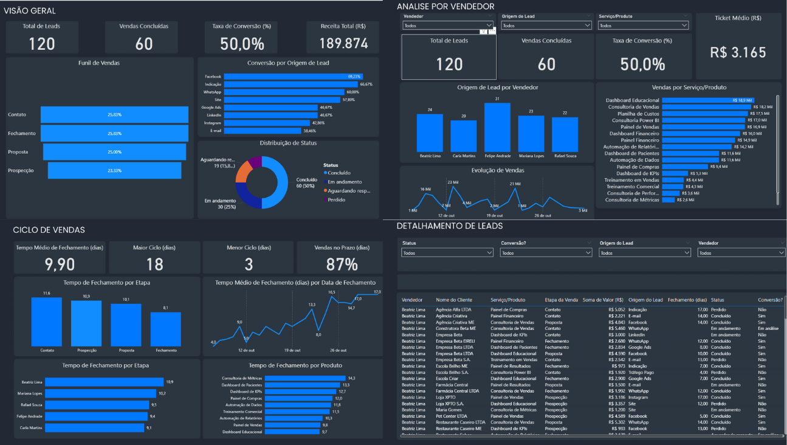

# 📊 Dashboard de Vendas – Power BI



## 🧠 Visão Geral
Projeto de **Business Intelligence** para monitorar desempenho comercial, funil e ciclo de vendas. 
Este repositório contém documentação, imagens e um dataset de **exemplo**, além do passo a passo para conectar a base real no Google Sheets.

> Autor: **Higor Maia** — Analista de TI (BI & Data Analytics)

---

## ⚙️ Principais Recursos do Dashboard
- **Visão Geral**: Total de Leads, Vendas Concluídas, Taxa de Conversão, Receita Total.
- **Funil de Vendas**: Prospecção → Proposta → Contato → Fechamento (com conversão por origem).
- **Análise por Vendedor**: Evolução de vendas, ticket médio, origem do lead por vendedor.
- **Ciclo de Vendas**: Tempo médio, maior/menor ciclo, % no prazo, tempo por etapa e produto.
- **Detalhamento de Leads**: Tabela completa com filtros dinâmicos (status, origem, vendedor).

---

## 📐 Métricas DAX (exemplo)
| Medida                               | Fórmula                                                                                                                                                                                             | Descrição                                                                         |                                                                      |                                                                    |
| ------------------------------------ | --------------------------------------------------------------------------------------------------------------------------------------------------------------------------------------------------- | --------------------------------------------------------------------------------- | -------------------------------------------------------------------- | ------------------------------------------------------------------ |
| **Total de Leads**                   | `DAX COUNTROWS( FILTER( 'Planilha de controle de vendas e leads', NOT(ISBLANK('Planilha de controle de vendas e leads'[Nome do Cliente])) ) ) `                                                     | Conta todos os leads válidos registrados na base.                                 |                                                                      |                                                                    |
| **Vendas Concluídas**                | ```DAX COUNTROWS( FILTER( 'Planilha de controle de vendas e leads', 'Planilha de controle de vendas e leads'[Status] = "Concluído"                                                                  |                                                                                   | 'Planilha de controle de vendas e leads'[Conversão?] = "Sim" ) ) ``` | Conta todos os leads que foram efetivamente convertidos em vendas. |
| **Taxa de Conversão (%)**            | `DAX DIVIDE([Vendas Concluídas], [Total de Leads], 0) `                                                                                                                                             | Calcula o percentual de leads convertidos em vendas.                              |                                                                      |                                                                    |
| **Conversão por Origem (%)**         | `DAX DIVIDE( COUNTROWS( FILTER( 'Planilha de controle de vendas e leads', 'Planilha de controle de vendas e leads'[Conversão?] = "Sim" ) ), COUNTROWS('Planilha de controle de vendas e leads') ) ` | Mede a conversão específica por origem de lead.                                   |                                                                      |                                                                    |
| **Taxa de Conversão por Canal (%)**  | `DAX DIVIDE([Vendas Concluídas (Canal)], [Total de Leads (Canal)], 0) `                                                                                                                             | Mostra a taxa de conversão separada por canal (WhatsApp, E-mail, Instagram etc.). |                                                                      |                                                                    |
| **Receita Total (R$)**               | `DAX SUMX( FILTER( 'Planilha de controle de vendas e leads', 'Planilha de controle de vendas e leads'[Conversão?] = "Sim" ), 'Planilha de controle de vendas e leads'[Valor (R$)] ) `               | Soma os valores das vendas concluídas.                                            |                                                                      |                                                                    |
| **Ticket Médio (R$)**                | `DAX DIVIDE([Receita Total (R$)], [Vendas Concluídas], 0) `                                                                                                                                         | Calcula o valor médio de cada venda realizada.                                    |                                                                      |                                                                    |
| **Tempo Médio de Fechamento (dias)** | `DAX AVERAGE('Planilha de controle de vendas e leads'[Tempo de Fechamento (dias)]) `                                                                                                                | Mostra o tempo médio para fechar uma venda.                                       |                                                                      |                                                                    |
| **Maior Ciclo (dias)**               | `DAX MAX('Planilha de controle de vendas e leads'[Tempo de Fechamento (dias)]) `                                                                                                                    | Exibe o maior ciclo de fechamento de venda registrado.                            |                                                                      |                                                                    |
| **Menor Ciclo (dias)**               | `DAX MIN('Planilha de controle de vendas e leads'[Tempo de Fechamento (dias)]) `                                                                                                                    | Exibe o menor ciclo de fechamento de venda registrado.                            |                                                                      |                                                                    |


---

## 🔗 Base de Dados (Google Sheets)
Este dashboard pode ser conectado diretamente à planilha:
**https://docs.google.com/spreadsheets/d/1LJ29I5mlXayyns2aMnS0aGoJ-cINJ4rUBzqvwo47xOE/edit?usp=sharing**

### Como conectar no Power BI Desktop
1. **Obter Dados** → **Planilhas Google**.  
2. Cole a URL **de exportação CSV** do Google Sheets (Arquivo → Compartilhar → Qualquer pessoa com o link / publicar na web ou use o link de CSV do GSheets).  
3. Use o **Power Query** para tratamento (tipos, datas, colunas calculadas, filtros).  
4. Atualize as relações e medidas no modelo.


---

## 🗂 Estrutura deste Repositório
```
dashboard-vendas-powerbi/
├─ assets/                    # Imagens do dashboard
├─ dataset/                   # Dados de exemplo + link da base
├─ documentos/                # Diagramas e PDFs de documentação
└─ README.md                  # Este arquivo
```

---

## 📁 Arquivos Importantes
- `assets/Paginas-BI.png`: print principal do relatório.
- `dataset/leads_vendas_exemplo.csv`: dataset fictício para demonstração/local.
- `dataset/google_sheet_link.txt`: link da base real no Google Sheets.
- `documentos/estrutura_modelo_dados.png`: (adicione seu diagrama de modelo aqui).

---

Link para acesso ao DashBoard: https://app.powerbi.com/view?r=eyJrIjoiM2IyZDQyYjctNjQ4ZC00Nzc2LTliMTQtNGFhOGE5Mjg4NzMyIiwidCI6IjMyZjE0YjcyLWYyYWYtNGVlZi1iZTA2LWViN2ZlYTI1M2IzMyJ9

---

## 🧰 Stack Tecnológica
- **Power BI Desktop** (Power Query + DAX)
- **Google Sheets** (fonte de dados)
- **Excel/CSV** (dados locais de exemplo)
- **Figma** (Criação dos Layouts)

---

## 📈 Resultados Esperados
- Visibilidade sobre taxa de conversão e funil.
- Entendimento do ciclo de vendas e gargalos por etapa/produto.
- Ranking de vendedores e origens de lead mais eficientes.
- Base para previsões/otimizações com ML (futuro).

🧠 O que eu aprendi com este projeto

Durante o desenvolvimento deste dashboard de vendas, aprimorei minhas habilidades em modelagem de dados, DAX e Power Query, criando um fluxo completo de ETL e visualização conectado a uma base no Google Sheets.
Aprendi a estruturar métricas de desempenho como taxa de conversão, ticket médio, ciclo de vendas e produtividade por vendedor, além de aplicar boas práticas de design e storytelling de dados no Power BI.
Esse projeto também reforçou minha capacidade de analisar indicadores comerciais e transformar informações em insights acionáveis para apoiar decisões estratégicas.

---

## 👤 Autor
**Higor Maia** — BI & Data Analytics  
💼 LinkedIn: https://www.linkedin.com/in/higor-maia/  
🐙 GitHub: https://github.com/higormaia01  
📧 E-mail: higorpachelly@outlook.com

---

## 📝 Licença
Distribuído sob licença **MIT**. Veja `LICENSE`.
